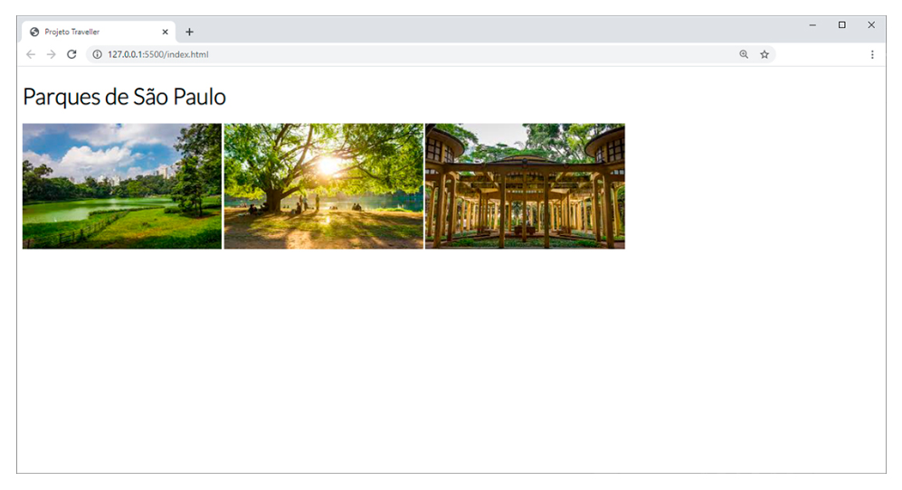
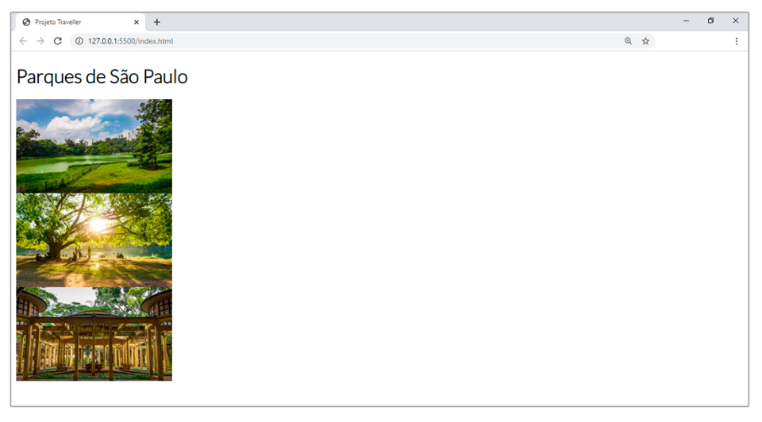

(<a href="../../README.md">readme</a>)

<h1 align=center>CAPÍTULO 2 - VÍDEOS</h1>
<h2 align=center>Continuando a Imersão do Conhecimento no Front-End</h2>

Markdown utilizado para tirar notas dos conteúdos **escritos**.

---

## ➡️ O Que Vem Por Aí!

| **VIDEO - *VS Code Atalhos* ([Anotações](Cap2Videos.md#➡️-vscode-atalhos))** |
| :---: |

(<a href="#readme-top">back to top</a>)

## ➡️ Tags são Caixas

|**VIDEO - *Estrutura de Projeto - PASTAS* ([Anotações](Cap2Videos.md#➡️-estrutura-de-projeto---pastas))**| **VIDEO - *Estrutura Básica HTML* ([Anotações](Cap2Videos.md#➡️-estrutura-básica-html))** |
| :---: | :---: |

| **VIDEO - *Conceito de Caixas* ([Anotações](Cap2Videos.md#➡️-conceito-de-caixas))** |
| :---: |

Por Padrão, as tags se comportam de duas formas diferentes:

| TAGS DE BLOCO (BLOCK) | TAGS DE LINHA (IN-LINE) |
| :--- | :--- |
| Ocupam todo o espaço da linha em que estão posicionadas, e dessa forma, não permitem que outras caixas (tags) sejam exibidas ao seu lado. São exemplos de tags que possuem esse comportamento:  **\<p\>\</p\>** **\<h1\>\</h1\>** Entre outras, que veremos logo mais. | Ocupam apenas o tamanho do seu conteúdo, permitindo que outras caixas sejam exibidas ao seu lado, caso exista espaço suficiente para isso. São exemplos de tags que possuem esse comportamento:  **\<a\>\</a\>** **\** Entre outras que veremos logo mais. |

| **VIDEO - *Títulos - Parágrados - Imagens* ([Anotações](Cap2Videos.md#➡️-títulos---parágrafos---imagens))** |
| :---: |

~~~html
<h1>Parques de São Paulo</h1>       

    
    
    

~~~

~~~css
img {
    display: block;
}
~~~

(<a href="#readme-top">back to top</a>)

## ➡️ DIV: A Caixa Mágica

### 🔷 Vídeo

| **VIDEO - *DIV* ([Anotações](Cap2Videos.md#➡️-div))** |
| :---: |

(<a href="#readme-top">back to top</a>)

### 🔷 Entendendo mais sobre as DIVs

| **VIDEO - *Introdução ao CSS - Como Funciona?* ([Anotações](Cap2Videos.md#➡️-introdução-ao-css---como-funciona))** |
| :---: |

| **VIDEO - *CSS Especificidade* ([Anotações](Cap2Videos.md#➡️-css-especificidade))** | **VIDEO - *Criando uma Formatação* ([Anotações](Cap2Videos.md#➡️-criando-uma-formatação))** |
| :---: | :--- : |

(<a href="#readme-top">back to top</a>)

### 🔷 Box Model

| **VIDEO - *Box Model - MARGEM* ([Anotações](Cap2Videos.md#➡️-box-model---margem))** |
| :---: |
| **VIDEO - *Box Model - BORDER* ([Anotações](Cap2Videos.md#➡️-box-model---border))** |
| :---: |
| **VIDEO - *Box Model - PADDING* ([Anotações](Cap2Videos.md#➡️-box-model---padding))** |
| :---: |

## ➡️ O Conteúdo da DIV

### 🔷 Mais Propriedades para DIVS

| **VIDEO - *Aplicando Imagem de Fundo* ([Anotações](Cap2Videos.md#➡️-aplicando-imagem-de-fundo))** |
| :---: |

## ➡️ Pedidos do Cliente

| **VIDEO - *Criando Links* ([Anotações](Cap2Videos.md#➡️-criando-links))** |
| :---: |

| **VIDEO - *Importando e Formatando Fontes* ([Anotações](Cap2Videos.md#➡️-importando-e-formatando-fontes))** |
| :---: |
