
(<a href="../../README.md">readme</a>)

<h1 align=center>CAPÍTULO 2 - VÍDEOS</h1>
<h2 align=center>Continuando a Imersão do Conhecimento no Front-End</h2>

Markdown utilizado para tirar notas dos conteúdos **escritos**.

---

## ➡️ O Que Vem Por Aí!

| **VIDEO - *VS Code Atalhos* ([Anotações](Cap2Videos.md#➡️-vscode-atalhos))** |
| :---: |

(<a href="#readme-top">back to top</a>)

## ➡️ Tags são Caixas

|**VIDEO - *Estrutura de Projeto - PASTAS* ([Anotações](Cap2Videos.md#➡️-estrutura-de-projeto---pastas))**| **VIDEO - *Estrutura Básica HTML* ([Anotações](Cap2Videos.md#➡️-estrutura-básica-html))** |
| :---: | :---: |

| **VIDEO - *Conceito de Caixas* ([Anotações](Cap2Videos.md#➡️-conceito-de-caixas))** |
| :---: |

Por Padrão, as tags se comportam de duas formas diferentes:

| TAGS DE BLOCO (BLOCK) | TAGS DE LINHA (IN-LINE) |
| :--- | :--- |
| Ocupam todo o espaço da linha em que estão posicionadas, e dessa forma, não permitem que outras caixas (tags) sejam exibidas ao seu lado. São exemplos de tags que possuem esse comportamento:  **\<p\>\</p\>** **\<h1\>\</h1\>** Entre outras, que veremos logo mais. | Ocupam apenas o tamanho do seu conteúdo, permitindo que outras caixas sejam exibidas ao seu lado, caso exista espaço suficiente para isso. São exemplos de tags que possuem esse comportamento:  **\<a\>\</a\>** **\** Entre outras que veremos logo mais. |

| **VIDEO - *Títulos - Parágrados - Imagens* ([Anotações](Cap2Videos.md#➡️-títulos---parágrafos---imagens))** |
| :---: |

~~~html
<h1>Parques de São Paulo</h1>       

    
    
    

~~~

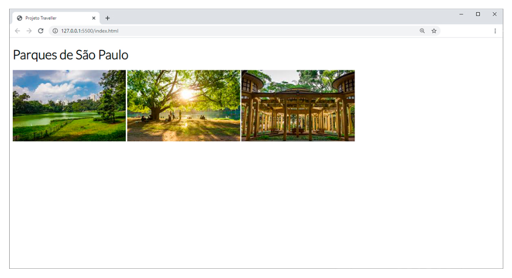

~~~css
img {
    display: block;
}
~~~

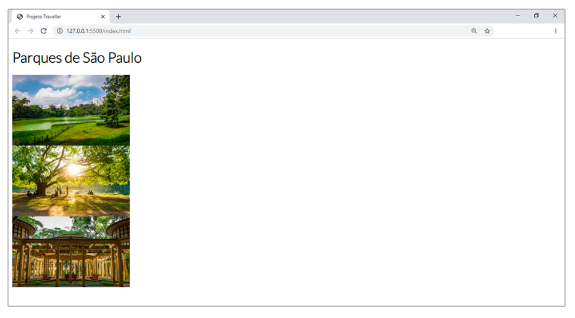

(<a href="#readme-top">back to top</a>)

## ➡️ DIV: A Caixa Mágica

### 🔷 Vídeo

| **VIDEO - *DIV* ([Anotações](Cap2Videos.md#➡️-div))** |
| :---: |

(<a href="#readme-top">back to top</a>)

### 🔷 Entendendo mais sobre as DIVs

A tag **\<div\>\<\/div\>** é um container que poderá ser criado para armazenar qualquer tipo de conteúdo. Imagina que poderemos inserir em uma tag **\<div\>** qualquer outra tag que comporá a nossa página. Podemos organizar os conteúdos dentro dessas caixas e definir como elas ficarão posicionadas no browser.

A mágica ficará totalmente por conta da CSS, as suas regras definirão toda a padronização das divs.

| **VIDEO - *Introdução ao CSS - Como Funciona?* ([Anotações](Cap2Videos.md#➡️-introdução-ao-css---como-funciona))** |
| :---: |

Basicamente, para criarmos uma div, basta usar a tag **\<div\>\<\/div\>** e inserir o conteúdo desejado nessa estrutura. Entenda que uma div pode receber qualquer tipo de conteúdo, inclusive outras divs. Por padrão, as divs são elementos **block** e ocupam todo o espaço da linha na qual estão inseridas.

| **VIDEO - *CSS Especificidade* ([Anotações](Cap2Videos.md#➡️-css-especificidade))** | **VIDEO - *Criando uma Formatação* ([Anotações](Cap2Videos.md#➡️-criando-uma-formatação))** |
| :---: | :---: |

Quando são criadas, as divs e as tags têm o tamanho exato do conteúdo, com a CSS podemos definir um novo tamanho para elas, basta usar as propriedades **width** (largura) e **height** (altura). Elas devem receber um valor válido de uma medida CSS, os valores mais comuns são:

- **%**
- **em**
- **rem**
- **pixel**

~~~CSS
div {
    width: 250px;
    height: 150px;
}
~~~

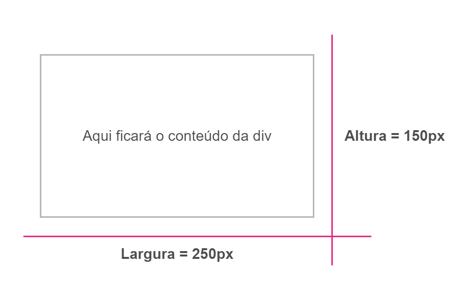

Não são apenas as divs que possuem altura e largura, essas propriedades estão presentes em praticamente todos os elementos HTML. Um bom exemplo são as imagens, podemos definir o tamanho que elas terão na página, declarando na CSS o **width** e **height** desejados.

Quando inserimos as divs, elas são posicionadas uma abaixo da outra, praticamente bem grudadas. Em seu interior fica o conteúdo que foi declarado no HTML, posicionado a partir do ínicio do container, parte esquerda superior.

Deve ter-se cuidado com o conteúdo, pois, caso ele seja maior que **\<div\>**, ocorrerá o que chamamos de transvordo (**overflow**), ultrapassando o tamanho definido.

(<a href="#readme-top">back to top</a>)

### 🔷 Box Model

| **VIDEO - *Box Model - MARGEM* ([Anotações](Cap2Videos.md#➡️-box-model---margem))** | **VIDEO - *Box Model - BORDER* ([Anotações](Cap2Videos.md#➡️-box-model---border))** | **VIDEO - *Box Model - PADDING* ([Anotações](Cap2Videos.md#➡️-box-model---padding))** |
| :---: | :---: | :---: |

O Box Model descreve como as divs devem ser montadas em nossa página, ele é composto por quatro elementos: **margin**, **border**, **padding** e **content**. Essas quatro propriedades, em conjunto com a largura e altura, definirão como ficará o seu container.

#### 🔹 MARGIN

Define a margem externa da div, entenda essa margem como o distanciamento que a div terá dos demais elementos que formam a página. Podemos definir valores para a margem: **top**, **right**, **bottom** e **left**, sempre nessa ordem.

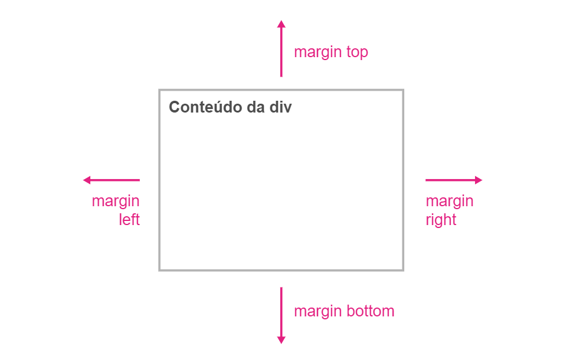

Podemos definir os valores de margem de quatro formas:

| Maneira | Representa |
| :---: | :---: |
| **UM Valor** | Ele será usado pelas quatro margens. |
| **DOIS Valores** | O **primeiro** valor será usado pelas margens **top** e **bottom**. O **segundo** valor será usado pelas margens **right** e **left**. |
| **TRÊS Valores** | O **primeiro** valor será usado pela margim **top**. O **segundo** valor será usado pelas margens **right** e **left** O **terceiro** valor será usado pela margem **bottom** |
| **QUATRO Valores** | O **primeiro** valor será usado pela margem **top** O **segundo** valor será usado pela margem **right** O **terceiro** valor será usado pela margem **bottom** O **quarto** valor será usado pela margem **left**  |

~~~CSS
div {
    /* declaração com um único valor */
    margin: 20px;
   
    /* declaração com dois valores */
    margin: 20px 40px;
   
    /* declaração com três valores */
    margin: 20px 40px 30px;
   
    /* declaração com quatro valores */
    margin: 20px 30px 40px 50px;
}
~~~

#### 🔹 BORDER

Define a borda (contorno) da div ou de qualquer outro elemento. Podemos ter borda top, right, bottom e left, igual às margens. As bordas são opcionais e é muito comum encontrarmos elementos sem elas, inclusive as divs.

| border-width | border-color | border-style |
| :--- | :--- | :--- |
| Define a largura da borda. | Define a cor que a borda terá. | Define o estilo que a borda terá. **Solid** (linha sólida) **Double** (linha dupla) **Dotted** (linha pontilhada) **Dashed** (linha riscada) **Groove** (dependendo da cor, as bordas esquerda e superior ficam com cores diferentes das bordas direita e inferior) **Ridge** (inverte a ordem das cores da opção groove) **Inset** (as bordas superior e esquerda ficam mais destacadas) **Outset** (as bordas inferior e direta ficam mais destacadas). |

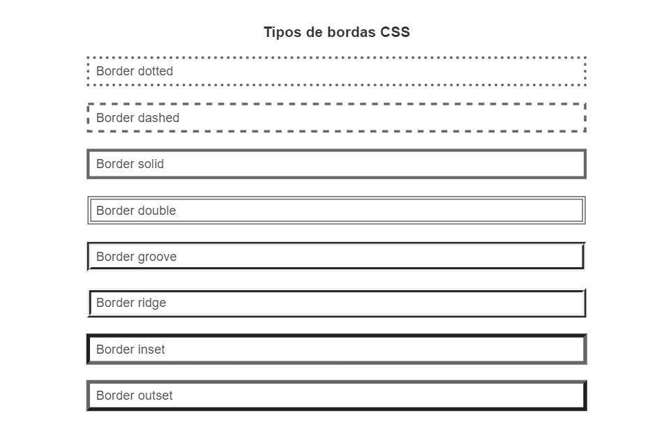

~~~CSS
div {
    width: 300px;
    height: 100px;
    margin: 20px;
    border-width: 5px;
    border-style: solid;
    border-color: #dc143c;
}
~~~

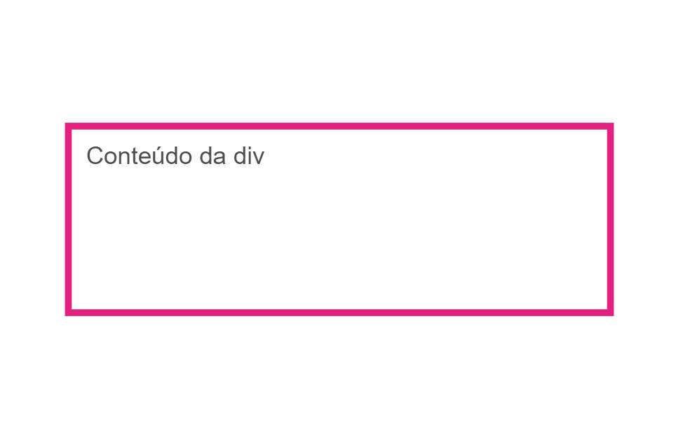

Podemos fazer uma declaração mais simplificada, basta usar a propriedade **border**, sequida da largura, do estilo e da cor desejada.

~~~CSS
div {
    width: 300px;
    height: 100px;
    margin: 20px;
    border: 5px dotted #dc143c;
 }
~~~

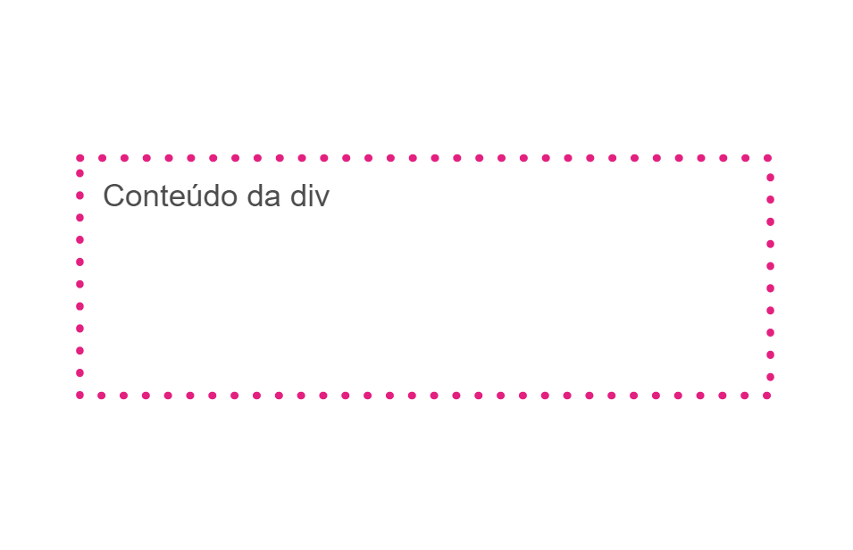

É possível também declarar apenas uma parte da borda: top, right, bottom e left.

~~~CSS
div {
    width: 300px;
    height: 100px;
    margin: 20px;
    border-top: 5px solid #dc143c;
    border-left: 5px solid #dc143c;
 }
~~~

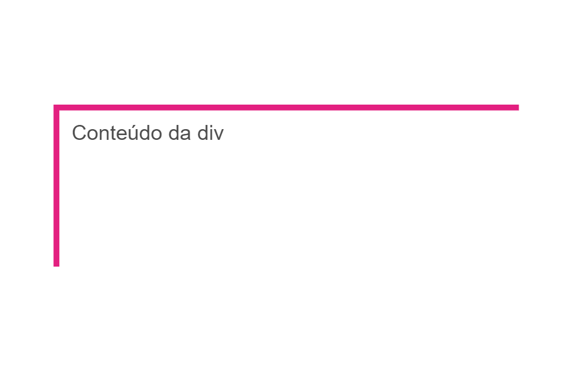

#### 🔹 PADDING

Define a margem interna (preenchimento) da div. Entenda essa margem como o distanciamento que o conteúdo terá das bordas ou extremidades da div. Podemos definir valores para o padding: top, right, bottom e left, da mesma forma que fizemos com a margem e a borda, ou seja: um único valor, dois valores, três valores ou quatro valores.

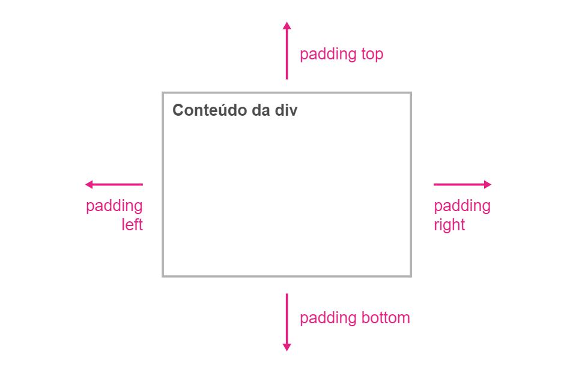

Quando usamos padding em uma div, o conteúdo ficará afastado das bordas, melhorando assim a sua visualização e apresentação no container.

~~~CSS
div {
    width: 300px;
    height: 100px;
    margin: 20px;
    border: 5px solid #dc143c;
}
~~~

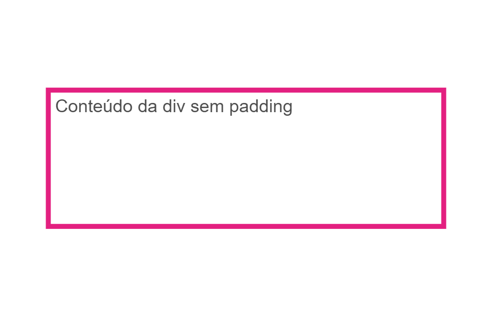

~~~CSS
div {
    width: 300px;
    height: 100px;
    margin: 20px;
    border: 5px solid #dc143c;
    padding: 20px;
}
~~~

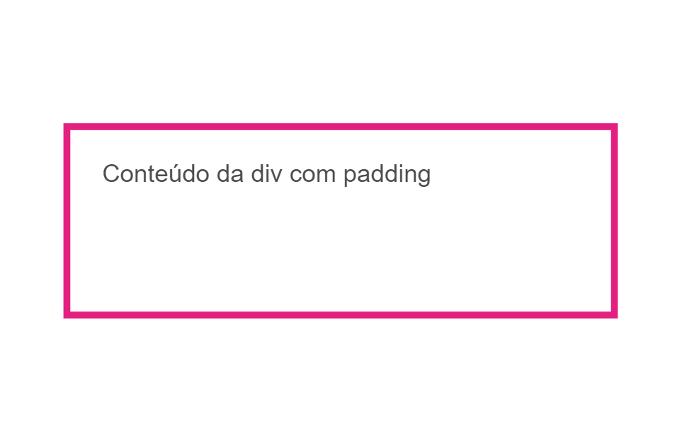

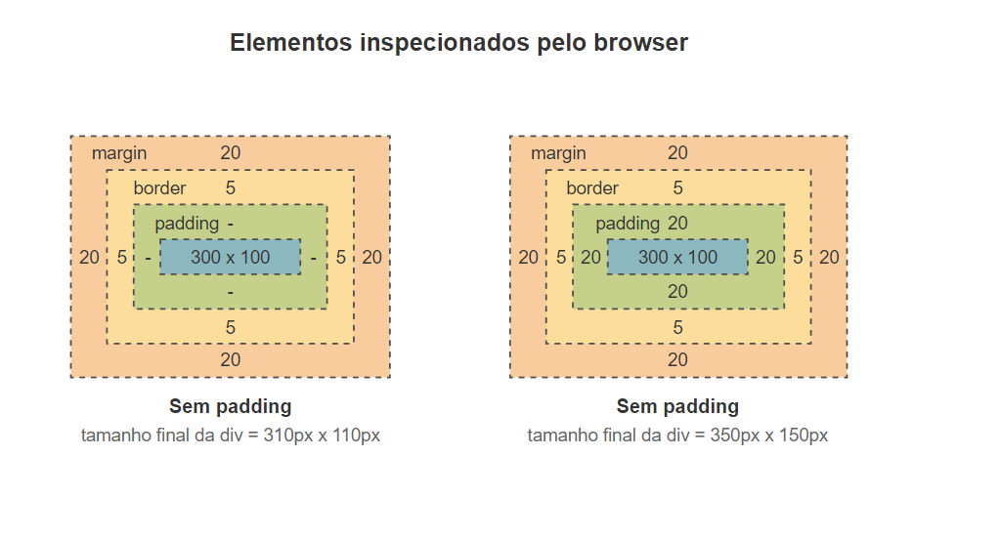

**Box-sizing**, que em conjunto com **border-box**, altera o comportamento dos elementos com padding, permitindo que o espaçamento interno seja aplicado, sem alterar a altura e largura do container.

~~~CSS
div {
    width: 300px;
    height: 100px;
    margin: 20px;
    border: 5px solid #dc143c;
    padding: 20px;
    box-sizing: border-box;
}
~~~

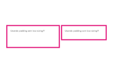

## ➡️ O Conteúdo da DIV

O **content** é o seu conteúdo dentro da div (caixa) e, como veremos, poderá ser controlado de diversas formas pela CSS.

### 🔷 Mais Propriedades para DIVS

#### 🔹 LIMITANDO ALTURA E LARGURA

Podemos definir a altura e a largura, máximas e mínimas, que um elemento pode ter quando exibido na janela do navegador. Essas propriedades podem ser bem úteis quando utilizarmos dispositivos móveis, pois podme ajudar na exibição do conteúdo.

Temos as seguintes propriedades:

- **max-width**: define a maior largura da div.
- **mamin-width**: define a menor largura da div.
- **max-height**: define a maior altura da div.
- **min-height**: define a menor altura da div.

~~~CSS
div {
    max-width: 300px;
    min-width: 100px;
    max-height: 300px;
    min-height: 200px; 
    border: 5px solid #dc143c;
    padding: 10px;
    box-sizing: border-box;
}
~~~

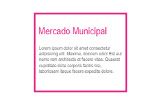

#### 🔹 OVERFLOW

Define o que acontecerá quando o conteúdo inserido em uma div for maior que ela. E possui as seguintes propriedades:

- **visible**: exibe o conteúdo que ultrapassar o tamanho da div; é o valor *padrão*.
- **hidden**: oculta o conteúdo que ultrapassar o tamanho da div.
- **scroll**: insere uma barra de rolagem na div quando algum conteúdo ultrapassar o tamanho dela. Com isso, o usuário poderá efetuar a rolagem desse conteúdo, alternando entre o que é exibido e o que fica oculto.

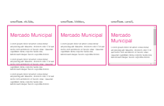

#### 🔹 BOX-SHADOW

Insere uma sombra em volta de uma caixa. podemos definir várias características para elas, sendo que os valores devem ser declarados na seguinte ordem:

- **inset**: se esse valor for declarado, a sombra será inserida internamente.
- **deslocamento horizontal**: define os valores para o posicionamento da sombra à direita ou à esquerda da caixa, valores positivos e negativos.
- **deslocamento vertical**: define os valores para o posicionamento da sombra, acima ou abaixo da caixa, valores positivos e negativos.
- **desfoque**: define o desfoque da sombra. Quanto maior for esse valor, o desfoque ficará maior e mais claro.
- **extensão da sombra**: define a expansão da sombra. Caso não seja declarado, a sombra terá exatamente o tamanho da caixa.
- **cor**: define a cor desejada para a sombra.

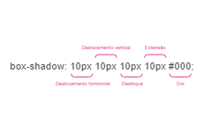

imagine que temos uma div com 300px de largura, 250px de altura, 10px de padding e borda e 5px, sólida na cor vermelha, veja como essa div ficará aplicando padrões de sombra diferentes:

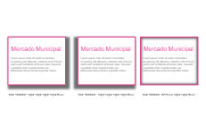

#### 🔹 BORDER-RADIUS

Quando inserimos uma borda em uma caixa, os cantos sempre terão ãngulos retos, e podemos arredondá-los utilizando a propriedade **border-radius**.

~~~CSS
div {
    border-radius: 10px;
}
~~~

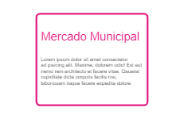

#### 🔹 COR DE FUNDO

Podemos aplicar uma cor de fundo para cada elemento HTML, para isso, basta usar a propriedade **background-color** tendo como valor a cor desejada. A cor pode ser declarada usando código hexadecimal, código rgb ou até mesmo o nome da cor em inglês. Casouma cor não seja definida, o elemento terá o fundo transparente.

~~~CSS
body {
    background-color: rgb(200, 200, 200);
}
div {
    background-color: #DC143C;
    color: #FFFFFF;
}
~~~

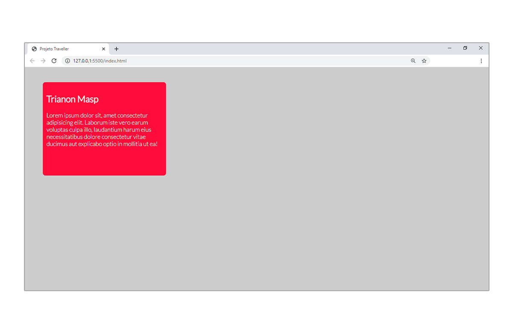

Lembre-se de que qualquer elemento HTML pode receber uma cor de fundo, mas tome cuidado com o exagero de cores na aplicação. Seria bem legal utilizar paletas de cores para o projeto, existem vários aplicativos que fazem isso para você, entre os mais usados, temos o [**Adobe Color**](https://color.adobe.com/pt/create/color-wheel). Nele você poderá criar as suas paletas baseando-se no que foi especificado pelo seu cliente. Existe também a possibilidade de consultar paletas de cores que são disponibilizadas pela ferramenta, basta utilizar a opção **explorar** encontrada no menu de navegação.

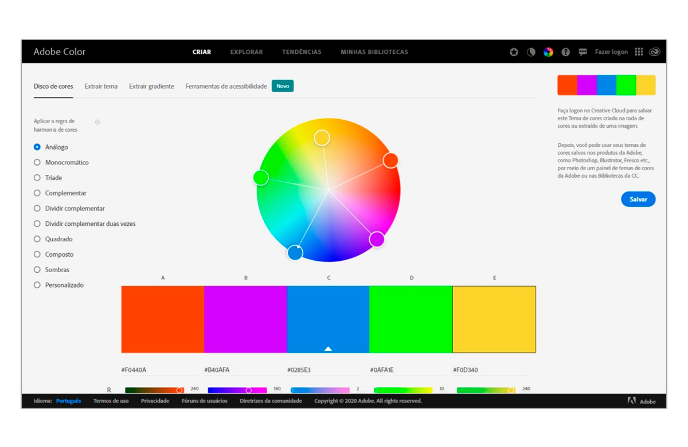

#### 🔹 IMAGEM DE FUNDO

| **VIDEO - *Aplicando Imagem de Fundo* ([Anotações](Cap2Videos.md#➡️-aplicando-imagem-de-fundo))** |
| :---: |

Da mesma forma que inserimos cores, podemos colocar imagens de fundo tanto no **body** da página quanto em qualquer outro elemento HTML. para isso, usamos a propriedade **background-image** seguida do endereço da imagem.

~~~CSS
body {
    background-image: url(../images/fundo-ibirapuera.jpg);
}
~~~

O valor do endereço da imagem deve começar com a sigla **url()**. Em seu interior, digitamos o local onde a imagem está armazenada.

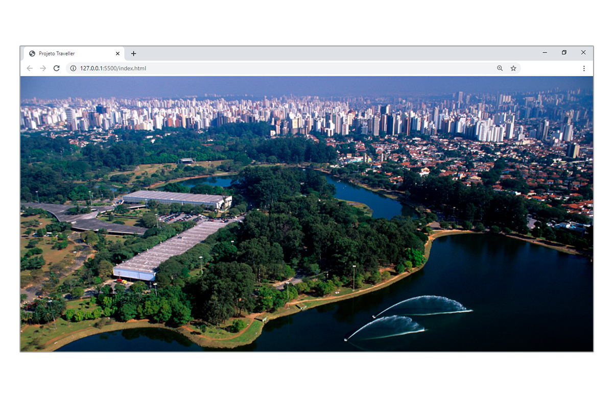

Por padrão, quando inserimos imagens de fundo, elas serão repetidas para ocupar todo o espaço do elemento. Podemos usar a propriedade **background-repeat**, como o valor **no-repeat**, para mudar esse padrão. Assim que ela for alterada, a imagem ficará posicionada na parte superior esquerda do elemento e não repetirá.

~~~CSS
div {
    width: 400px;
    height: 300px;    
    border: 1px solid #000;
    background-image: url(../images/icone.png);
    background-repeat: no-repeat;
}
~~~

Caso você necessite, podemos fazer com que as imagens repitam apenas em um determinado eixo da caixa, eixo x, para a largura, ou eixo y, para a alutra. para isso, usamos a propriedade **background-repeat**, com os valores **repeat-x** ou **repeat-y**.

~~~CSS
div {
    background-repeat: repeat-x;
}
div {
    background-repeat: repeat-y;
}
~~~

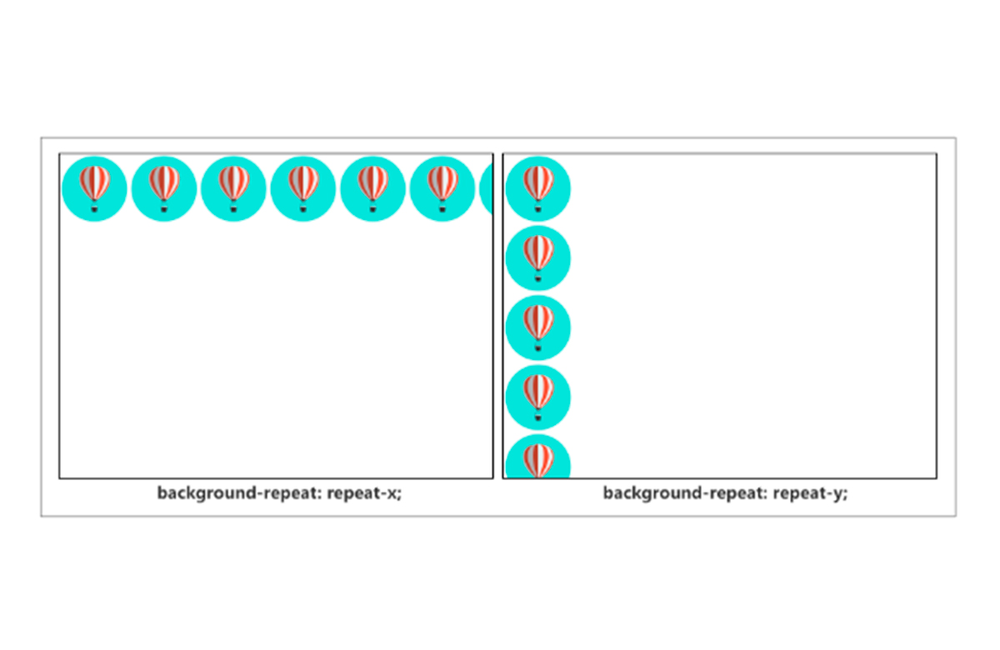

As imagens de funso, quando não repetidas, poderão ter um posicionamento específico dentro da caixa. Para isso, basta usar a propriedade **background-position**, seguida de algum valor válido:

| Valores em PIXEL | Valores em PORCENTAGEM | Palavras-Chave |
| :---: | :---: | :---: |
| Pode definir dois valores me pixels para o posicionamento da imagem - o **primeiro** valor será o eixo **horizontal** e o **segundo**, o **vertical** | Mesma regra que se aplica aos valores em pixels, só que agora usando **porcentagem**. | Mesma regra que se aplicam aos valores em pixels e porcentagem, só que agora usando palavras que representam a posição que ela deve ficar. Podemos usar: **top**, **bottom**, **left**, **right** e **center**. |

~~~CSS
div {
    background-repeat: no-repeat;
    background-position: 50px 30px;
}
div {
    background-repeat: no-repeat;
    background-position: 70% 80%;
}
div {
    background-repeat: no-repeat;
    background-position: top center;
}
~~~

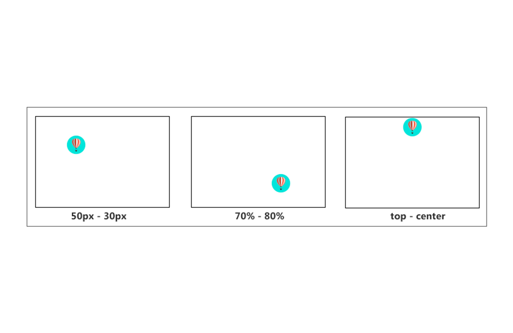

As imagens de fundo podem ser configuradas para que fiquem fixas na tela ou acompanhem o seu scroll, para isso, usaremos a propriedade **background-attachment**, com os seguintes valores:

- **fixed**: a imagem ficará sempre fixa (visível) na tela, independente do croll que for realizado.
- **scroll**: a imagem acompanhará o scroll da tela e só ficará visível na área em que foi posicionada.

~~~CSS
div {
    background-repeat: no-repeat;
    background-position: center 50px;
    background-attachment: fixed;
}
div {
    background-repeat: no-repeat;
    background-position: center 50px;
    background-attachment: scroll;
}
~~~

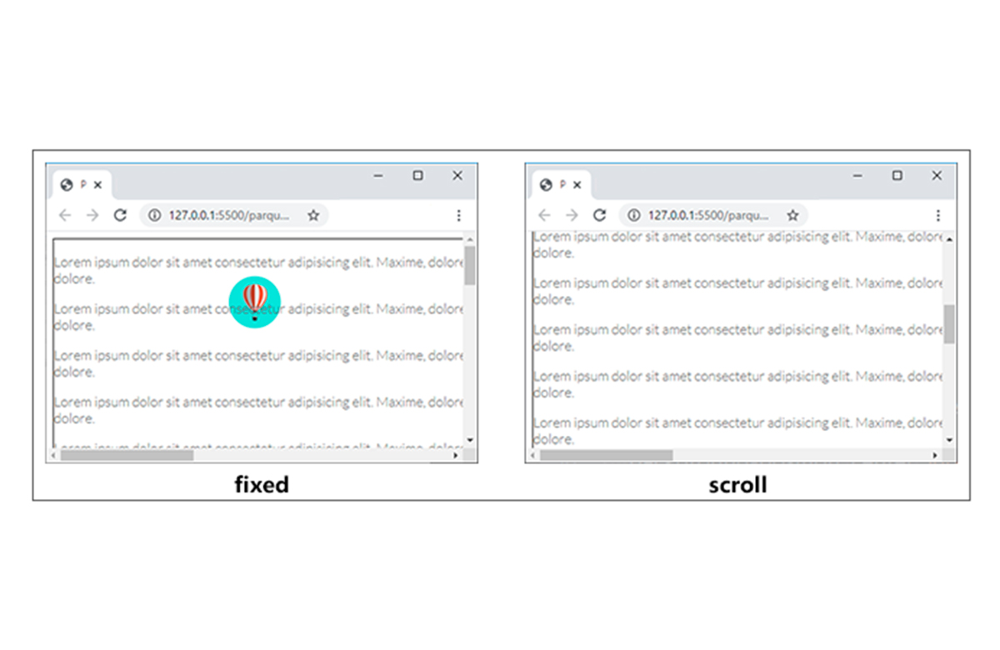

As imagens de fundo também poderão ter seu tamanho redimensionado, para isso, usamos a propriedade **background-siz**, que pode receber os seguintes valores:

| Valores para LARGURA e ALTURA | CONTAIN | COVER |
| :---: | :---: | :---: |
| Podemos definir o tamanho da imagem de fundo definindo valores máximos, em **pixels**, ou **porcentagem** para a altura e/ou largura, exatamente nessa ordem. | A imagem tentará ocupar toda a caixa, caso ela não consiga preencher toda a área, veremos a cor de funda dacaixa, se não tiver sido preenchida. | A imagem ocupará toda a caixa, independente do tamanho do container. Essa é a opção mais utilizada para colocarmos imagens de fundo na tag **body**, ou em grandes seções da página que devem ser totalmente preenchidas. |

~~~CSS
div {
    background-repeat: no-repeat;
    background-position: center center;
    background-size: 100px 100px;
}
div {
    background-repeat: no-repeat;
    background-position: center 50px;
    background-size: contain;
}
div {
    background-repeat: no-repeat;
    background-position: center 50px;
    background-size: cover;
}
~~~

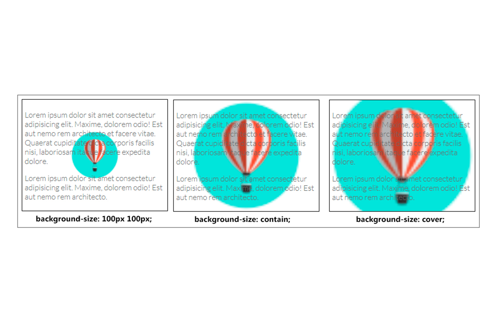

Agora sabemos que existem duas formas de inserir imagens em uma página, usando a tag **\** e usando a propriedade **background-image**. Mas qual é a melhor maneira? Vamos pensar da seguinte forma:

- Se uma imagem for apenas para a estilização e não existir nenhum tipo de interação entre ela e o usuário, use a propriedade **background-image**.
- Se a imagem possuir algum tipo de interação com o usuário, como, por exemplo, ela é o link para algum conteúdo, então use a tag **\**.
- Outro ponto em favor ao uso da tag **\** diz respeito à acessibilidade, podemos e devemos usar o atributo **alt** para fazer uma pequena descrição da imagem, para favorecer usuários que tiveram alguma deficiência visual e fizeram uso de leitores de tela, que descreverá o conteúdo inserido nesse atributo.

## ➡️ Pedidos do Cliente

### 🔷 Arquivo HTML

~~~HTML
<!DOCTYPE html>
<html lang="en">
<head>
    <meta charset="UTF-8">
    <meta name="viewport" content="width=device-width, initial-scale=1.0">
    <link rel="stylesheet" href="./css/style.css">
    <title>Conheça o novo Drone da DJI</title>
</head>
<body>
    

        <h1>DJI MAVIC 3</h1>
        

            Lorem ipsum dolor sit amet, consectetur adipisicing elit. Quasi ducimus natus quae sapiente temporibus, quam
            ea consequatur unde cum nulla, modi culpa accusantium, qui doloribus reprehenderit minima.
        

        

            <a href="droneDJI3.html">Veja Mais</a>
        

    

</body>
</html>
~~~

A **\<div\>** recebeu todos os elementos dessa página: um título em **\<h1\>**, um pequeno árágrado **\<p\>** e um link para uma página **ibirapuera.html**. Sabemos que apenas isso não será suficiente, então a folha de estilo terá de fazer a diferença.

| **VIDEO - *Criando Links* ([Anotações](Cap2Videos.md#➡️-criando-links))** |
| :---: |

### 🔷 Arquivo CSS

~~~CSS
@import url('https://fonts.googleapis.com/css2?family=Lato:wght@300&family=Open+Sans+Condensed:wght@300&display=swap');

html {
    font-family: 'Lato', sans-serif;
}

body {
    background-image: url(../images/ibirapueraimg/baixados.jpg);
    background-repeat: no-repeat;
    background-size: cover; 
    font   
}

div {
    width: 400px;
    height: 300px;
    margin: 175px 150px105px 60px;
    padding: 20px;
    box-sizing: border-box;
    background-color: rgba(28, 58, 149, 0.9);rgb(1 1 1 / 55%);
    border-radius: 20px;
    border: 4px solid #ad9898;
}

h1 {
    color: #fff;
    font-size: 30px;
    text-transform: uppercase;
    font-weight: 200;
    font-weight: bolder;
}

p {
    color: #fff;
    font-size: 16px;
    text-align: justify;
    line-height: 25px;
    margin-bottom: 40px;
}

a {
    color: rgb(28, 58, 149);
    text-decoration: none;
    font-weight: 900;
    border: 1px solid #fff;
    background-color: #fff;
    padding: 10px 30px;
    box-sizing: border-box;
}
~~~

| **VIDEO - *Importando e Formatando Fontes* ([Anotações](Cap2Videos.md#➡️-importando-e-formatando-fontes))** |
| :---: |

No arquivo style.css, fizemos as seguintes formatações:

- Importamos a família de fontes, que foi definida no início do projeto.
- Aplicamos a família de fontes a todos os elementos da página, criando uma regra utilizando o seletor de tag **html**.
- No seletor de tag **body**, definimos que a imagem de fundo não se repetirá e que ocupará toda a tela.
- A **div** recebeu como formatação a largura de 400px, altura de 300px, margin superior e inferior em 175px, direita e esquera 150px. Foi definido padding de 20px e usamos também a propriedade box-sizing para que o valor atribuído não seja acionado ao tamanho da caixa. Perceba que colocamos uma cor de fundo na div com o valor rgba(28,58,149,0.9), tonalidade da cor azul recebendo um pouco de transparência.
- O seletor da tag **h1** ficará na cor branca (#FFFFFF), com tamanho de 30px, terá todas as letras maiúsculas e o peso da fonte em 200, ficando, assim, mais fina.
- O seletor da tag **p** também ficará na cor branca (#FFFFFF), tamanho do texto em 16px, texto justificado, altura da linha em 25px e margem inferior em 40px.
- Já o link terá seu texto na cor rgb(28.58.149), não terá o sublinhado, ficará com peso da fonte em 900 (mais grossa). Foi inserida uma borda na cor branca e estilo de linha sólida, o fundo também será branco e para que tenhamos uma área clicável maior, foi definido o padding superior e inferior em 10px, direito e esquerdo em 30px.

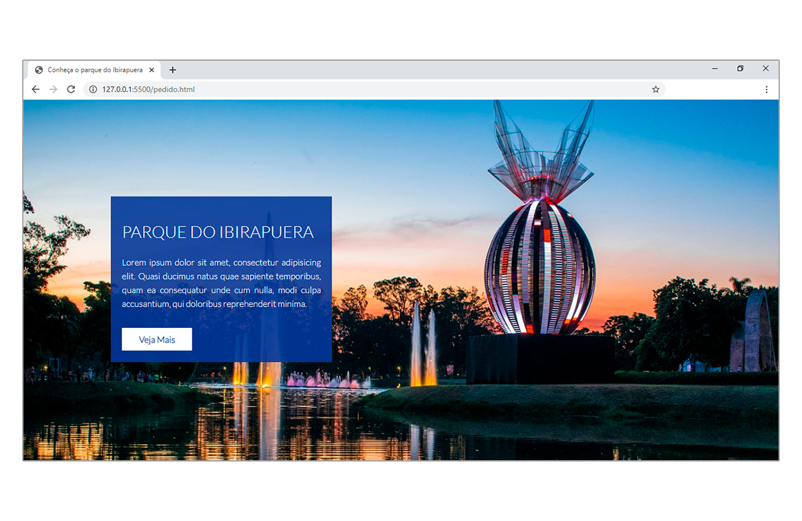
