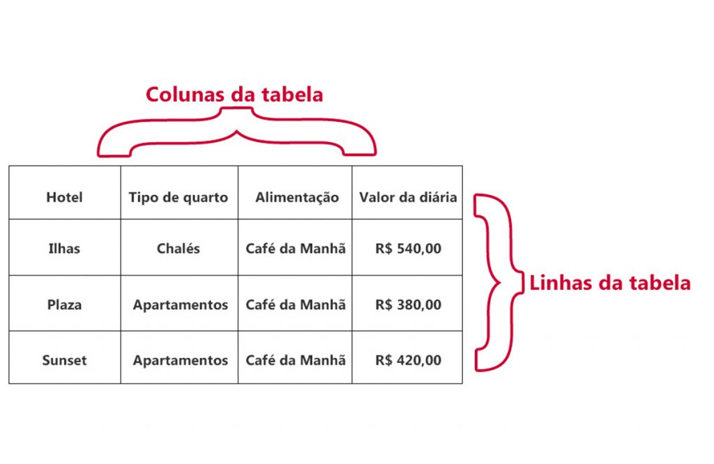
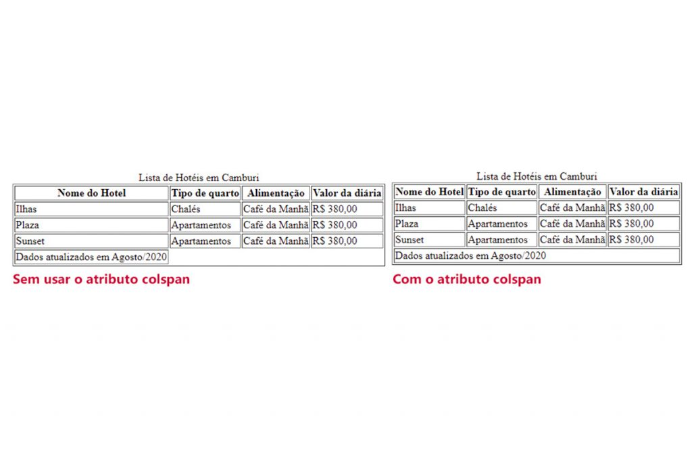
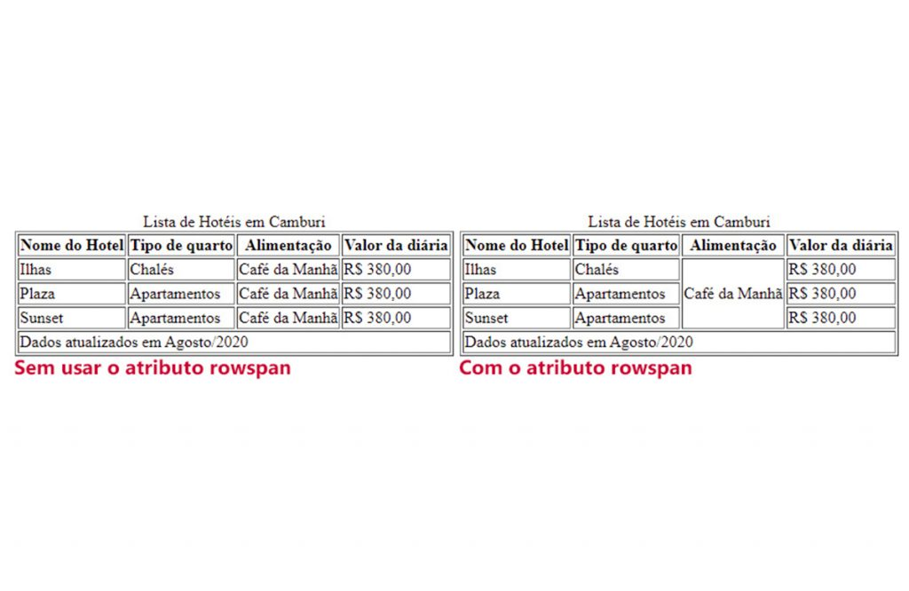
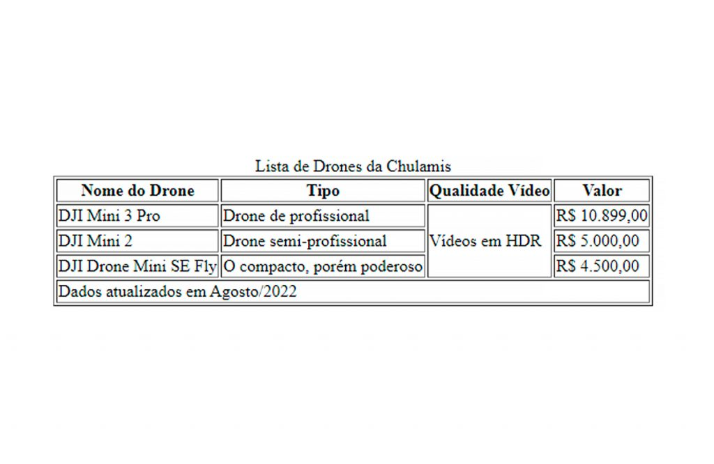

    
(<a href="../../README.md">readme</a>)

    <h1 align=center>CAPÍTULO 3</h1>
    <h2 align=center>Aprender mais HTML 5 e Aplicar CSS para Entregar Mais e Ficar Mais Próximo da Experiência do Usuário</h2>

Markdown utilizado para tirar notas dos conteúdos **escritos**.

---

## 📌 INTRODUÇÃO

Tabelas são comumente usadas para a exibição de dados, é muito fácil encontrá-las em nosso dia a dia:

- Tabelas de pontos dos times em um campeonato
- Tabela de valor de um produto
- Tabela de funcionários de uma empresa
- Tabela com a relação de Drones em uma cidade

| **VIDEO - *Tabelas - Conceito e Criação* ([Anotações](Cap3Videos.md#➡️-tabelas---conceito-e-criação))** |
| :---: |

A ideia é exibir dados de uma forma organizada e que torne muito fácil para o usuário entender o que eles representam. Vale ressaltar que os dados contidos nas tabelas devem ser acessíveis a todos, inclusive para pessoas que usam leitores de tela para navegar pela Internet. Acessibilidade é um direito de todos.

A criação de tabelas com HTML é uma tarefa muito fácil, pois existem tags para todos os elementos que a compões:

- Títulos
- Linhas
- Colunas

A representação dos dados deve sequir uma organização que deixe as informações bem claras ao usuário, pois não devemos deixar nenhum tipo de dúvida quanto ao dado apresentado.

Como qualquer elemento HTML, toda a parte de formatação deve ser feita com o uso de folhas de estilo criadas com código CSS. Podemos estilizar qualquer área da tabela, deixando, assim, o conteúdo mais agradável.

Devemos uasr tabelas apenas e tão somente para a exibição de dados. Os elementos que formam uma tabela descrevem semanticamente os dados, fazer uso de tabela para outros fins não é uma boa prática e isso nunca deve ser feito.

~~~HTML
<TR>
	<TD ROWSPAN=3>
		</TD>
	<TD COLSPAN=8 ROWSPAN=2>
      
   </TD>
	<TD COLSPAN=4 ROWSPAN=3>
		
   </TD>		
</TR>
~~~

(<a href="#readme-top">back to top</a>)

## ➡️ Criando uma Tabela

### 🔷 Tag \<TABLE\>

Para criarmos nossas tabelas em html, usamos a tag **\<table\>\</table\>**. É dentro dela que deve ficar todo o conteúdo que formará a tabela. Esse conteúdo deverá estar dentro de suas respectivas linhas e colunas. Apenas com a tag **\<table\>** não teremos nenhuma visualização no navegador.

~~~HTML
<table>
   Conteúdo da tabela…
   Conteúdo da tabela…
   Conteúdo da tabela…
</table>
~~~

(<a href="#readme-top">back to top</a>)

### 🔷 Tag \<CAPTION\>

A tag **\<caption\>\</caption\>** insere um título na tabela, esse título poderá ser usado para identificar o conjunto de dados que a tabela representa. Pensando na usabilidade, empregue sempre essa tag, ela deverá estar logo após a abertura da **\<table\>**

~~~HTML
<table>
   <caption> Título da tabela </caption>
   Conteúdo da tabela…
   Conteúdo da tabela…
   Conteúdo da tabela…
</table>
~~~

(<a href="#readme-top">back to top</a>)

### 🔷 Tag \<TR\>

Utilizada para a criação das linhas que existirão na tabela. Dentro de cada linha, teremos as respectivas colunas com seus conteúdos. A sigla **tr** significa "table row".

~~~HTML
<table>
   <caption> Título da tabela </caption>
   <tr> Linha da tabela… </tr>
   <tr> Linha da tabela… </tr>
   <tr> Linha da tabela… </tr>
</table>
~~~

(<a href="#readme-top">back to top</a>)

### 🔷 Tag \<TD\>

Utilizada para a criação das colunas na tabela. Elas devem ficar dentro da tag **\<tr\>** para possibilitar a exibição dos dados. É dentro da **\<td\>** que as informações devem ser inseridas. A sigla **td** significa "table data".

~~~HTML
<table>
   <caption> Título da tabela </caption>
   <tr>
      <td> dado da tabela </td>
      <td> dado da tabela </td>
      <td> dado da tabela </td> 
   </tr>
</table>
~~~

(<a href="#readme-top">back to top</a>)

### 🔷 Tag \<TH\>
A primeira linha de dados da tabela é considerada uma das mais importantes porque nela são definidos os nomes das colunas, dessa forma, o usuário identificará o conjunto de informações que está armazenado em cada uma delas. Para isso, podemos substituir a tag **\<td\>** pela tag **\<th\>**, a diferença é que ele deixará o nome da coluna centralizado e com estilo negrito. Mas a principal diferença será a acessibilidade: para pessoas com leitores de tela, ele informará o que significa cada uma das colunas.

~~~HTML
<table>
   <caption> Título da tabela </caption>
   <tr>
      <th> Nome para a coluna </th>
      <th> Nome para a coluna </th>
      <th> Nome para a coluna </th> 
   </tr>
</table>
~~~

(<a href="#readme-top">back to top</a>)

### 🔷 Agrupando Elementos na Tabela

Você pode dividir o conteúdo da sua tabela em cabeçalho, corpo e rodapé. Eles não são obrigatórios, mas poderão ajudar a agrupar os dados existentes na tabela de uma forma mais organizada e ajudar na hora da formatação com a CSS. Para fazer essa divisão, você deve usar as tags **\<thead\>**, **\<tbody\>** e **\<tfoot\>**.

(<a href="#readme-top">back to top</a>)

### 🔷 Tag \<THEAD\>

Após o uso da tag **\<caption\>**, podemos criar o que chamamos de cabeçalho da tabela utilizando a tag **\<thead\>**. Ele servirá para identificar a primeira linha da tabela, aquela que provavelmente terá os nomes de cada coluna de dados. Em tabelas muito grandes e que forem impressas, essa linha sempre será repetida no início de uma nova página impressa, facilitando assim a identificação dos dados ali exibidos.

~~~HTML
<table>
   <caption> Lista de Drones da Chulamis </caption>
   <thead>
      <tr>
         <th> Nome do Drone </th>
         <th> Tipo </th>
         <th> Qualidade Vídeo </th>
         <th> Valor </th> 
      </tr>
   </thead>
</table>
~~~

(<a href="#readme-top">back to top</a>)

### 🔷 Tag \<TBODY\>

Podemos inserir todas as linhas e colunas de dados em um elemento **\<tbody\>**, o corpo da tabela. A ideia é a organização dos dados agrupando-os em uma área específica da tabela.

| **VIDEO - *Agrupando Dados* ([Anotações](Cap3Videos.md#➡️-agrupando-dados))** |
| :---: |

~~~HTML
<tbody>
   <tr>
      <td>DJI Mini 3 Pro </td>
      <td>Drone de profissional</td>
      <td>Vídeos em HDR em 4K </td>
      <td>R$ 10.899,00 </td>
   </tr>
   <tr>
      <td>DJI Mini 3 PRO </td>
      <td> Drone semi-profissional </td>
      <td>Vídeos em HDR em 3K </td>
      <td>R$ 5.000,00</td>
   </tr>
</tbody>
~~~

(<a href="#readme-top">back to top</a>)

### 🔷 Tag \<TFOOT\>

A tag **\<tfoot\>** representará a linha de rodapé da sua tabela. Seu uso é totalmente opcional e muitas vezes você encontrará tabelas sem esse elemento.

Na maioria das vezes, usamos o **\<tfoot\>** como uma linha para alguma observação sobre os dados: um comentário, marca de rodapé, algo nesse sentido.

A documentação oficial especifica que a tag **\<tfoot\>** deverá ser inserida em nosso código logo após a tag **\<thead\>**, abaixo dela deverá vir a tag **\<tbody\>** com seu conteúdo. Pode parecer estranho, mas o navegador conseguirá fazer a renderização da forma correta.

~~~HTML
<tfoot>
   <tr>
      <td> Dados atualizados em Agosto/2022 </td>
   </tr>
</tfoot>
~~~

(<a href="#readme-top">back to top</a>)

### 🔷 Mesclando Linhas e Colunas

Às vezes, precisamos juntar linhas ou colunas em uma tabela, para isso, podemos usar os atributos **colspan** e **rowspan**.

(<a href="#readme-top">back to top</a>)

### 🔷 Atributo COLSPAN

O atributo **colspan** define o núnmero de colunas que devem ser mescladas. Imagine que temos uma linha **\<tr\>** com quatro colunas e que desejamos que o conteúdo fique em uma única coluna, para isso basta inserir na primeira **\<td\>** dessa linha o atributo **colspan** com o número de colunas que desejamos mesclar, nesse exemplo, o valor será 4.

~~~HTML
<tfoot>
   <tr>
      <td colspan="4">Dados atualizados em Agosto/2020</td>
   </tr>
</tfoot>
~~~

(<a href="#readme-top">back to top</a>)

### 🔷 Atributo ROWSPAN

O atributo rowspan define o número de linhas que devem ser mescladas. Imagine que você quer uma coluna com apenas um valor para todas as três linhas de uma tabela. Basta inserir na primeira **\<td\>** dessa linha o atributo **rowspan** com o número com o número de linhas que deseja mesclas, nesse caso, 3.

~~~HTML
<tr>
   <td rowspan="3">Vídeos em HDR</td>
</tr>
~~~

(<a href="#readme-top">back to top</a>)

## ➡️ Estilizando a Tabela

| **VIDEO - *Estilizando a Tabela* ([Anotações](Cap3Videos.md#➡️-estilizando-a-tabela))** |
| :---: |

Se juntarmos os códigos exemplificados e acrescentarmos algumas linhas de conteúdo na tabela, teremos o seguinte:

~~~HTML
<table border="1">
    <caption> Lista de Drones da Chulamis </caption>
    <thead>
        <tr>
            <th> Nome do Drone </th>
            <th> Tipo </th>
            <th> Qualidade Vídeo </th>
            <th> Valor </th>
        </tr>
    </thead>
    <tbody>
        <tr>
            <td>DJI Mini 3 Pro </td>
            <td>Drone de profissional</td>
            <td rowspan="3">Vídeos em HDR</td>
            <td>R$ 10.899,00 </td>
        </tr>
        <tr>
            <td>DJI Mini 2 </td>
            <td> Drone semi-profissional </td>
            <td>R$ 5.000,00</td>
        </tr>
        <tr>
            <td>DJI Drone Mini SE Fly </td>
            <td>O compacto, porém poderoso </td>
            <td>R$ 4.500,00</td>
        </tr>
    </tbody>
    <tfoot>
        <tr>
            <td colspan="4"> Dados atualizados em Agosto/2022 </td>
        </tr>
    </tfoot>
</table>
~~~

Podemos observar a exibição desse código no navegador.

Pensamos em um código CSS mais ou menos assim:

~~~CSS
@import url('https://fonts.googleapis.com/css2?family=Lato:wght@300&amp;family=Open+Sans+Condensed:wght@300&amp;display=swap');
html {
   font-family: 'Lato', sans-serif;
}
table {    
   margin: 10px auto;
   font-size: 18px;
   width: 800px;
   border-collapse: collapse;
}
caption {
   font-size: 30px;
   color: rgb(42, 98, 172);
   text-align: center;
   font-weight: 900;
   margin-bottom: 10px;
}
thead tr {
   background: rgb(42, 98, 172);
   color: #fff;
   text-align: left;
}
th, td {
   padding: 15px;
   box-sizing: border-box;
}
tbody tr {
   border-bottom: 1px solid #ccc;
}
tbody tr:nth-child(even) {
   background: #f9f9f9;
}
tbody tr:last-child {
   border-bottom: 20px solid rgb(42, 98, 172);
}
tbody tr:hover {
   font-weight: 900;
   color: rgb(42, 98, 172);
   cursor: pointer;
}
tfoot {
   text-align: center;
   font-size: 13px;
   font-weight: 900;
}
~~~

Vamos entender o que foi feito aqui:

A tabela foi centralizada, para isso, as margens receberam os valores de 10px para a margem superior e inferior e automática para a direita e esquerda, assim, não importa a tela em que essa tabela for exibida, ela sempre estará centralizada. E o tamanho da fonte padrão de 18px, e a largura total de 800px.

Perceba que temos uma nova propriedade: border-collapse com o valor collapse, nesse caso, a ideia é juntar as bordas da tabela, não permitindo que exista algum espaço entre suas colunas.

O caption ficou com o tamanho do texto maior que o restante da tabela, 30px. A cor da fibte utilizada foi o rgb(42, 98, 172) e o texto ficou centralizado. Também aumentamos a espessura do texto e deixamos uma margem inferior em 10px.

Todas as linhas que estão no **thead**, (thead tr) terão cor de fundo rgb(42, 98, 172), cor do texto #FFFFFF e alinhamento do texto à esquerda.

Todas as **ths** e **tds**, (th e td) terão o preenchimento em 15px e não terão o valor usado atribuído ao tamanho do elemento.

Toads as linhas de dados do **tbody** (tbody tr) terão borda inferior em 1px no estilo sólido e na cor #CCCCCC.

Usamos também uma pseudoclasse para as linhas de dados pares, **tbody tr:nth-child(even)**, nesse caso, elas devem ficar com cor de fundo #f9f9f9. As pseudoclasses permitem aplicar formatações a alguma condição de uma elemento, veremos mais sobre elas em breve. Esse efeito, aplicado às linhas partes, deixará a tabela como se estivesse "zebrada", facilitando a leitura para o usuário.

A última linha do **tbody** também recebeu uma pseudoclasse, **tbody tr:last-child**, nesse caso, teremos uma borda inferior em 20px, estilo sólida na cor rgb(42, 98, 172).

No **tbody**, quando passamos o mouse sobre as linhas (**tbody tr:hover**), o conteúdo ficará na cor rgb(42, 98, 172), com espessura em 900 e o cursor ficará no formato de uma mãozinha. Com certeza ficará mais fácil para o usuário ler o conteúdo da tabela. E o **tfoot** dteve o seu texto centralizado, com fonte em 13px e espessura em 900.

(<a href="#readme-top">back to top</a>)
